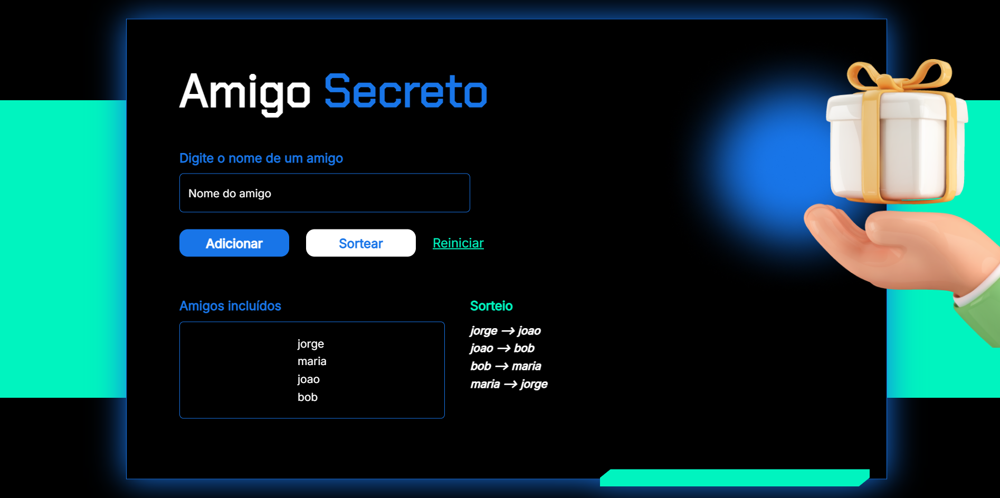

# 🎁 Amigo Secreto

Uma aplicação web simples e divertida para organizar sorteios de amigo secreto.  
Você pode adicionar amigos, realizar o sorteio de forma aleatória e visualizar o resultado diretamente na tela.

---

## 📸 Preview

---

## 🧩 Funcionalidades

- ✅ Adiciona amigos à lista (com validação de nome duplicado e campos vazios).
- 🔀 Realiza sorteios aleatórios, garantindo que todos recebam um amigo.
- 🔄 Reinicia a lista e o sorteio com um clique.
- ❌ Permite remover amigos clicando no nome.
- ⚡ Interface elegante, responsiva e moderna com feedback visual.

---

## 🛠️ Tecnologias Utilizadas

- **HTML5** – Estrutura da página.
- **CSS3** – Estilo com animações e visual moderno.
- **JavaScript** – Lógica do sorteio e manipulação da lista.
- **Google Fonts** – Chakra Petch & Inter.
- **Reset & Normalize CSS** – Estilo consistente entre navegadores.

---

